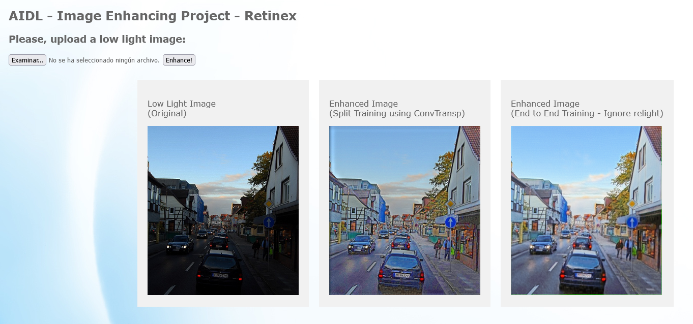

# LOW-LIGHT IMAGE ENHANCEMENT

### UPC School
### Authors: Alberto Camacho, Marcos Carlevaro, Vanessa Castillo, Pablo López
### Advisor: Dani Fojo

---

## Index

- Introduction
- Datasets
- About the model
- Model Training
- Results
- Bottlenecks
- Conclusions
- Execution Instructions
- App Usage

## Introduction

In this project we implement RetinexNet with PyTorch based on this paper:

[Deep Retinex Decomposition for Low-Light Enhancement](https://paperswithcode.com/paper/deep-retinex-decomposition-for-low-light)

We know that insufficient lighting can significantly degrade the visibility of images and that there are many reconstruction/enhancing techniques in order to get better quality.  

  

We chose Retinex model as an effective tool for low-light image enhancement. One of the main reasons was that it assumes that observed images can be decomposed into their reflectance and luminance, a theory that was postulated by Edwin Herbert Land which denies trichromatic Newton color theory and states that color is a brain active composition done by comparison.  

  

[¿Qué es el color? La teoría Retinex de Land](http://opticaluzycolor.blogspot.com/2011/03/que-es-el-color-la-teoria-retinex-de.html?m=1)

## Datasets

We used both datasets already used in the original paper:

Dataset 1: [LOL (LOw-Light dataset)](https://drive.google.com/file/d/157bjO1_cFuSd0HWDUuAmcHRJDVyWpOxB/view)  
500 real images (485 to train and 15 to test), 400x600px.

Dataset 2: [Synthetic pairs](https://drive.google.com/file/d/1G6fi9Kiu7CDnW2Sh7UQ5ikvScRv8Q14F/view)  
1250 images (1000 to train and 250 to test), different sizes.

And we have created our own set of 10 pair of images with normal and low light to test the final model, these are some examples:

## About the model
In the figure below we can find the proposed framework for Retinex-Net. The enhancement process is divided into three steps: decomposition, adjustment and reconstruction. In the decomposition step, a subnetwork Decom-Net decomposes the input image into reflectance and illumination. In the following adjustment step, an encoder-decoder based Enhance-Net brightens up the illumination. Multi-scale concatenation is introduced to adjust the illumination from multi-scale perspectives. Noise on the reflectance is also removed at this step. Finally, we reconstruct the adjusted illumination and reflectance to get the enhanced result.

As illustrated in the figure above, Decom-Net takes the low-light image *S_low* and the normal-light one *S_normal* as input, then estimates the reflectance *R_low* and the illumination *I_low* for *S_low*,
as well as *R_normal* and *I_normal* for *S_normal*, respectively. It first uses a 3×3 convolutional layer to extract features from the input image. Then, several 3×3 convolutional layers with ReLU as the activation function are followed to map the RGB image into reflectance and illumination. A 3×3 convolutional layer projects *R* and *I* from feature space, and sigmoid function is used to constrain both *R* and *I* in the range of *[0, 1]*.  

The loss *L* consists of three terms: reconstruction loss *L_recon*, invariable reflectance loss *L_ir*, and illumination smoothness loss *L_is*:  

where *λ_ir* and *λ_is* denote the coefficients to balance the consistency of reflectance and the smoothness of illumination. 

Based on the assumption that both *R_low* and *R_high* can reconstruct the image with the corresponding illumination map, the reconstruction loss *L_recon* is formulated as:  

Invariable reflectance loss *L_ir* is introduced to constrain the consistency of reflectance:

Illumination smoothness loss Lis is formulated as:

where ∇ denotes the gradient, including *∇_h* (horizontal) and *∇_v* (vertical), and *λ_g* denotes the coefficient balancing the strength of structure-awareness.

## Model training

We have trained the net in mainly 4 different ways:

* **Decom-Net and Enhance-Net separately**  
This is how the model is trained in the original paper. In this case there are 2 different optimizers, one for each net. First, the Decom-Net is trained for all the epochs and once the training has finished it is used in eval mode so the Enhance-Net is trained for all the epochs using the Decom-Net already trained. The original model in the paper uses convolutional layers and an increasing resize function using interpolation in order to apply skip connections in the Enhance-Net. In the critical review of the project we decided to change those layers removing the resizing and using transposed convolutional layers intead, so we have the following two experiments:  
    * *With convolutional + resize layers in Enhance-Net*
    * *With convolutional transposed layers in Enhance-Net*
* **Decom-Net and Enhance-Net together**  
We decided to try training both nets at the same time, joining both optimizers and loss functions in order to compare results with the original model. In this case we observed that the results of the Enhance-Net were white images, so the net wasn't contributing much to the final result. We then thought that since the Decom-Net was already obtaining good results with the reflectance image, we could try ignoring the Enhance-Net. Hence we get the following two other experiments:
    * *Training both nets*
    * *Ignoring Enhance-Net*

In the end we haven't used any denoising operation. Both the one referenced in the paper (BM3D) and the alternative we found in the OpenCV library (fastNlMeansDenoising) were complex to apply and didn't add visible improvement in the resulting enhanced images. We haven't done any hyperparameter tunning neither, as we indeed had a loss definition for the model training but no other metric that allowed us to compare which final enhanced images were better, except for our subjective human eye.

In all four experiments we have trained 200 epochs and started with learning rate at 0.001 for both nets, using a scheduler. We tried both StepLR and ReduceOnPlateau, but StepLR delivered better results.

We have used [Wandb](https://wandb.ai/site) in order to check the performance of all the models form the different experiments.

We have trained in [Google Cloud](https://cloud.google.com/?hl=es) with the following properties:

## Results
For each experiment there is a link to the Wandb report, so we can check the Decom-Net and Enhance-Net output images for every epoch of the training.

### Decom-Net and Enhance-Net separately
* [With convolutional + resize layers in Enhance-Net](https://wandb.ai/aidl_retinex/retinex/reports/Experiment-3--VmlldzoxODYzNDIx?accessToken=60nx4c5yxf7zm8z5cerreejs0hs40oxte0d7kxa0h51x4x34ozmzxm3jdedzxygz)  

| | Decom-Net | Enhance-Net |
| ------------    | -----------  | ----------- |
| Training Loss   | 0.008 | 0.120 |
| Validation Loss | 0.008 | 0.134 |

* [With convolutional transposed layers in Enhance-Net](https://wandb.ai/aidl_retinex/retinex/reports/Experiment-4--VmlldzoxODYzNDQ5?accessToken=6jhwumkcsi5o3ocjh82xc0rdg73v69l39aj8daizksn8zssk6sqlxgucw85rv0k1)  

| | Decom-Net | Enhance-Net |
| ------------    | -----------  | ----------- |
| Training Loss   | 0.007 | 0.123 |
| Validation Loss | 0.007 | 0.129 |

For these 2 exepriments we could see that the results looked really similar, but then comparing some enhanced images from the test set, we could observe that using interpolation instead of transposed convolutional layers had some issues with plain color zones, creating some noise:

### Decom-Net and Enhance-Net together
* [Training both nets](https://wandb.ai/aidl_retinex/retinex/reports/Experiment-1--VmlldzoxODYzMzU0?accessToken=uprm4x1mdqf8v52niitxwzlxxokmc2bfglkedinqjpk0887ms3gxqku7wdqp3d56)

| | Decom-Net | Enhance-Net |
| ------------    | -----------  | ----------- |
| Training Loss   | 0.014 | 0.096 |
| Validation Loss | 0.014 | 0.107 |

* [Ignoring Enhance-Net](https://wandb.ai/aidl_retinex/retinex/reports/Experiment-2--VmlldzoxODYzNDAy?accessToken=fcacjitj4dpgzwmbd31tjfrjckvbpav97me54rk3xirvxznb3c0y3qk677zulto1)

| | Decom-Net | Enhance-Net |
| ------------    | -----------  | ----------- |
| Training Loss   | 0.016 | 0.099 |
| Validation Loss | 0.014 | 0.113 |

  

In the case of training both Decom-NEt and Enhance-Net together, we could actually observe that output images for the Enhance-Net were all white in both experiments. The Decom-Net then gets good enhancing results for itself, but the decomposition is not actually luminance and reflectance, but something else that works anyway as image enhancing.

## Bottlenecks

* **Finding good training sets**  
We needed pairs of dark/normal light images and there weren't many of them already built. Good proof of this issue is that even in the original paper they had to use syntetically darkened images.

* **Image size in order to use transposed convolutions**  
In the beginning, the input image size for the model was 300x300, but we found that when we introduced the transposed convolutions in the Enhance-Net this value didn't work. The problem was that in the Enhance-Net we had skip connections and the output sizes of the encoder layers (convolutions) had to match with the output sizes of the decoder layers (transposed convolutions) and it didn't happen. We had two main options: changing the layers parameters or changing the initial input image size. We decided that it was better to maintain the parameters of all layers to be the same as in the original paper so, applying the formulas for obtaing the output size of convolutional and transposed convolutional layers and solving the equations system, we found that the closest value to 300x300 that worked for us was 297x297.

* **Wandb was slow in some cases**

* **Google Cloud VM resources limitations** 

## Conclusions
Originally, we had two main goals in this project regarding the model:  
* Obtaining good image decomposition representations applying Retinex theory in real images (I+R).
* Obtaining good quality results in enhancing low-light images.

If we want to maintain both goals, we would choose the model that trained both nets separately and replaced the interpolation upsizing with transposed convolutional layers because without the transposed convolutions we observed some noise in the enhanced images and training both nets together resulted in a image decomposition that wasn't luminance+reflectance. 

But if our only goal was enhancing dark images, without thinking about the I+R decomposition theory, we would choose the model that trained both nets together, as the final enhanced images look better to our eyes. 

## Execution Instructions

| Argument | Description | Default value | Comment |
|----------|-------------|---------------|---------|
|-e|--n_epochs|20|Amount of epochs to train with|
|-dlr|--decom_lr|0.001|Learning rate for decomposition|
|-rlr|--rel_lr|0.001|Learning rate for relight|
|-m|--mode|split|join: train decom and relight together, split: train decom and relight separately|
|-i|--ignore_ienhance|False|Bool to ignore enhanced luminance if mode is join|
|-s|--s_epochs|10|Amount of epochs to store model|
|-t|--transposed|False|Use convolutional transpose|

Examples (for our 4 experiments):

`python main.py -e 200 -m join`  
`python main.py -e 200 -m join -i True`

`python main.py -e 200`  
`python main.py -e 200 -t True`

## App Usage
The application is made with [Flask](https://flask.palletsprojects.com/en/2.1.x/quickstart/).

To run it, just execute `python app.py` in terminal from the *application* folder, then enter local host in the web explorer:  

Upload any image and the app will show the 2 enhanced images from the chosen models in the conclusions.