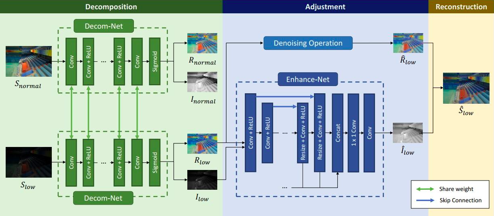

# LOW-LIGHT IMAGE ENHANCEMENT

### UPC School
### Authors: Alberto Camacho, Marcos Carlevaro, Vanessa Castillo, Pablo López
### Advisor: Dani Fojo

---

## Index

- Introduction
- Datasets
- About the model
- Model Training
- Results
- Conclusions
- Execution Instructions
- App Usage

## Introduction

In this project we implement RetinexNet with PyTorch based on this paper:

[Deep Retinex Decomposition for Low-Light Enhancement](https://paperswithcode.com/paper/deep-retinex-decomposition-for-low-light)

We know that insufficient lighting can significantly degrade the visibility of images and that there are many reconstruction/enhancing techniques in order to get better quality.  

  

We chose Retinex model as an effective tool for low-light image enhancement. One of the main reasons was that it assumes that observed images can be decomposed into their reflectance and luminance, a theory that was postulated by Edwin Herbert Land which denies trichromatic Newton color theory and states that color is a brain active composition done by comparison.  

  

[¿Qué es el color? La teoría Retinex de Land](http://opticaluzycolor.blogspot.com/2011/03/que-es-el-color-la-teoria-retinex-de.html?m=1)

## Datasets

We used both datasets already used in the original paper:

Dataset 1: [LOL (LOw-Light dataset)](https://drive.google.com/file/d/157bjO1_cFuSd0HWDUuAmcHRJDVyWpOxB/view)  
500 real images (485 to train and 15 to test), 400x600px.

Dataset 2: [Synthetic pairs](https://drive.google.com/file/d/1G6fi9Kiu7CDnW2Sh7UQ5ikvScRv8Q14F/view)  
1250 images (1000 to train and 250 to test), different sizes.

And we have created our own set of 10 pair of images with normal and low light to test the final model, these are some examples:

## About the model
In the figure below we can find the proposed framework for Retinex-Net. The enhancement process is divided into three steps: decomposition, adjustment and reconstruction. In the decomposition step, a subnetwork Decom-Net decomposes the input image into reflectance and illumination. In the following adjustment step, an encoder-decoder based Enhance-Net brightens up the illumination. Multi-scale concatenation is introduced to adjust the illumination from multi-scale perspectives. Noise on the reflectance is also removed at this step. Finally, we reconstruct the adjusted illumination and reflectance to get the enhanced result.

## Model training

We have trained the net in mainly 4 different ways:

* **Decom-Net and Enhance-Net separately**  
This is how the model is trained in the original paper. In this case there are 2 different optimizers, one for each net. First, the Decom-Net is trained for all the epochs and once the training has finished it is used in eval mode so the Enhance-Net is trained for all the epochs using the Decom-Net already trained. The original model in the paper uses convolutional layers and an increasing resize function using interpolation in order to apply skip connections in the Enhance-Net. In the critical review of the project we decided to change those layers removing the resizing and using transposed convolutional layers intead, so we have the following two experiments:  
    * *With convolutional + resize layers in Enhance-Net*
    * *With convolutional transposed layers in Enhance-Net*
* **Decom-Net and Enhance-Net together**  
We decided to try training both nets at the same time, joining both optimizers and loss functions in order to compare results with the original model. In this case we observed that the results of the Enhance-Net were white images, so the net wasn't contributing much to the final result. We then thought that since the Decom-Net was already obtaining good results with the reflectance image, we could try ignoring the Enhance-Net. Hence we get the following two other experiments:
    * *Training both nets*
    * *Ignoring Enhance-Net*

In the end we haven't used any denoising operation. Both the one referenced in the paper (BM3D) and the alternative we found in the OpenCV library (fastNlMeansDenoising) were complex to apply and didn't add visible improvement in the resulting enhanced images. 

In all four experiments we have trained 200 epochs and started with learning rate at 0.0001 for both nets, using a scheduler. We tried both StepLR and ReduceOnPlateau, but StepLR delivered better results.

We have used [Wandb](https://wandb.ai/site) in order to check the performance of all the models form the different experiments.

We have trained in [Google Cloud](https://cloud.google.com/?hl=es) with the following properties:

## Results
*!!!!!! Is it possible links to 4 wandb workspaces? Either way, some screenshots of training and eval curves and images of all the nets and final results in each experiment:*

* Decom-Net and Enhance-Net separately
    * With convolutional + resize layers in Enhance-Net
    * With convolutional transposed layers in Enhance-Net  
    
*!!!!!! do we want to explain that we had to change the image input size in order to maintain the parameters through layers?*
* Decom-Net and Enhance-Net together
    * Training both nets
    * Ignoring Enhance-Net  
    *!!!!!! explain here that decomposition is not actually luminance and reflectance, but something else that works anyway as image enhancing).*

## Conclusions
*!!!!!! Which model is best for us? Why?*

## Execution Instructions
*!!!!!! We could prepare a script that installs requirements and executes four experiments. Explain here what are the options in that script*

## App Usage
*!!!!!! TO-DO*

*Flask*
